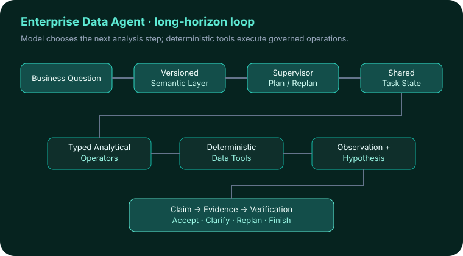
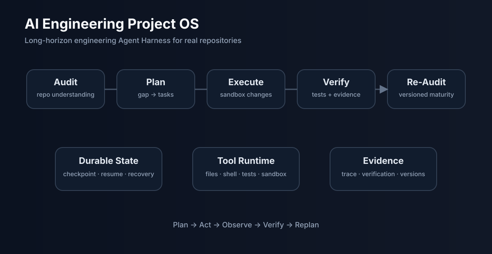
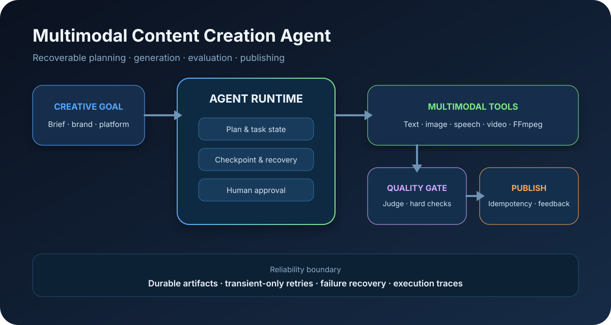

# Benjamin Daoson

I build **reliable AI Agent systems**, study **LLM post-training and evaluation**, and explore **Physical AI**.

My work is organized around three technical lines—**Agent Systems, LLM & Model Systems, and Physical AI**. Five integrated Lab pages map the portfolio, while representative projects remain independent repositories.

## AI Systems Lab

| Hub | Scope |
| --- | --- |
| [Agent Systems Lab](./labs/agent-systems/README.md) | Agent runtime, harness, planning, tools, memory, recovery, evaluation, and enterprise RAG |
| [LLM Systems Lab](./labs/llm-systems/README.md) | Post-training, reward modeling, preference optimization, robustness, and multimodal judges |
| [Embodied AI Lab](./labs/embodied-ai/README.md) | VLA, robot learning, embodied data, teleoperation, simulation, and real-world evaluation |
| [AI Research Lab](./labs/ai-research/README.md) | Research questions, benchmarks, controlled experiments, and paper-oriented artifacts |
| [Engineering Tools Lab](./labs/engineering-tools/README.md) | AI engineering infrastructure, developer productivity, release gates, and automation |

The Lab pages are maintained inside this Profile repository. They organize and explain the portfolio without creating one repository per navigation layer.

Canonical status, ownership, and archive mapping: [Portfolio Index](./PORTFOLIO_INDEX.md).

---

## Six representative projects

### 🤖 Agent Systems

<table>
<tr>
<td width="33%" valign="top">

### [Enterprise Data Agent](https://github.com/Benjamindaoson/enterprise-data-agent) <code>FLAGSHIP</code>
**Business Intelligence & Autonomous Operations**

Long-horizon business-analysis Agent with durable task state, Semantic Layer, governed analytics, evidence verification, HITL safety, BusinessAgentBench, PostgreSQL/Redis runtime, and observability.

</td>
<td width="33%" valign="top">

### [AI Engineering Project OS](https://github.com/Benjamindaoson/ai-engineering-project-os) <code>FLAGSHIP</code>
**Agent Harness for Long-Horizon Engineering**

Audits real repositories, identifies engineering gaps, executes changes in a controlled workspace, verifies completion with tests and evidence, persists state, recovers failures, and re-audits project maturity.

</td>
<td width="33%" valign="top">

### [Multimodal Content Creation Agent](https://github.com/Benjamindaoson/multimodal-content-creation-agent) <code>FLAGSHIP</code>
**Recoverable Multimodal Production Runtime**

Plans scripts and shots, orchestrates text/image/speech/video tools, checkpoints long-running jobs, evaluates outputs, gates human approval, and records publishing feedback.

</td>
</tr>
</table>

### 🧠 LLM & Model Systems

<table>
<tr>
<td width="50%" valign="top">

### [Reward Modeling Lab](https://github.com/Benjamindaoson/reward-modeling-lab) <code>FLAGSHIP</code>
**8B Reward Model Post-training**

Single-GPU 4-bit QLoRA reward-model training followed by shortcut, ranking, and robustness audits. The project asks whether a reward model succeeds for the right reason, not only whether it reaches high pairwise accuracy.

</td>
<td width="50%" valign="top">

### [RewardLens](https://github.com/Benjamindaoson/RewardLens) <code>RESEARCH FLAGSHIP</code>
**Multimodal Judge / Reward-Model Evaluation**

Controlled visual interventions test whether models with similar static accuracy actually rely on visual evidence in the same way.

</td>
</tr>
</table>

### 🦾 Physical AI

<table>
<tr>
<td width="100%" valign="top">

### [FitGround](https://github.com/Benjamindaoson/FitGround) <code>FLAGSHIP</code>
**Physics-Grounded Decision Engine**

Executable garment parameters → measured geometry → simulation evidence → explicit next-edit decision or abstention.

</td>
</tr>
</table>

Current Physical AI build: [Embodied-DataOps](https://github.com/Benjamindaoson/Embodied-DataOps) is tracked as an **Active Build** in the [Embodied AI Lab](./labs/embodied-ai/README.md). Private research is described by direction only and is not linked.

---

## Selected case studies

These systems and experiments have independent value but are intentionally not positioned at the same level as the flagship portfolio.

- [SalesBoost](https://github.com/Benjamindaoson/SalesBoost) — enterprise multi-Agent sales platform with Hybrid RAG, workflows, evaluation, and observability.
- [SmartOrderingAgent](https://github.com/Benjamindaoson/SmartOrderingAgent) — approval-gated reservation Agent with deterministic business writes.
- [API Test Platform](https://github.com/Benjamindaoson/api-test-platform) — Agent-assisted API quality, regression planning, and evidence-based release gates.
- [StuckToShip](https://github.com/Benjamindaoson/stuck-to-ship) — evidence-grounded AI engineering tutor for RAG, LangGraph, and MCP learning.
- [haole-mas](https://github.com/Benjamindaoson/haole-mas) — multi-Agent workspace with Redis Streams, MCP, HITL, and durable events.
- [FinEvidence](https://github.com/Benjamindaoson/finevidence-financial-rag) — financial RAG and evidence-intelligence platform with structure-aware chunking, hybrid retrieval, finance-aware reranking, evidence qualification, and evaluation.

## Teaching & public infrastructure

- [AI Agent Engineering Lab](https://github.com/Benjamindaoson/ai-agent-engineering-lab) — teaching repository for Agent runtime, RAG, MCP, A2A, multimodal, and workflow engineering.
- [TIAI Website](https://github.com/Benjamindaoson/TIAI_website) — institutional website.
- [Personal Website](https://github.com/Benjamindaoson/daoson_website) — technical writing, project notes, and public knowledge base.

## Portfolio principles

Public repositories distinguish:

- **implemented** from planned;
- **measured** from illustrative;
- **production-shaped** from production-deployed;
- **research evidence** from product claims.

  <b>Build useful AI systems · run real experiments · report measured evidence.</b>

