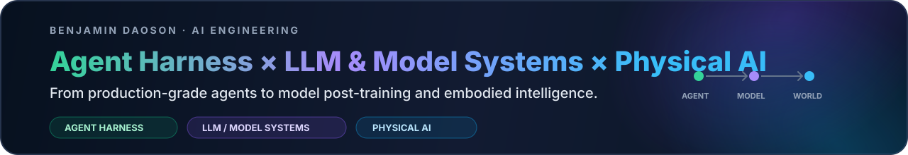
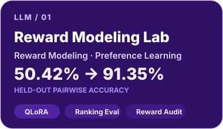
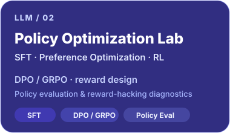
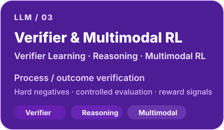
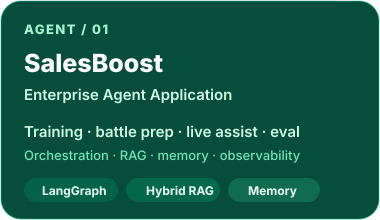
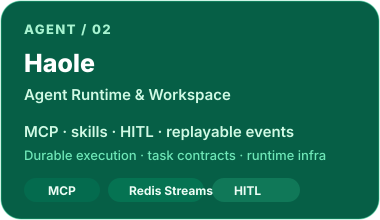
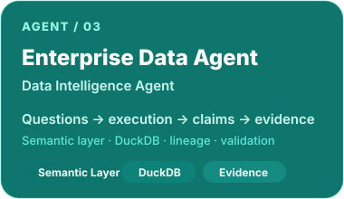

<p align="center">
  
</p>

<p align="center">
  <a href="https://benjamindaoson.github.io/">Portfolio</a> ·
  <a href="https://github.com/Benjamindaoson?tab=repositories">Repositories</a>
</p>

---

<p align="center">
  
</p>

<table>
<tr>
<td width="33.33%" align="center" valign="top">
<a href="https://github.com/Benjamindaoson/reward-modeling-lab"></a>
</td>
<td width="33.33%" align="center" valign="top">

</td>
<td width="33.33%" align="center" valign="top">

</td>
</tr>
</table>

<p align="center">
  
  
  
  
  
  
</p>

<p align="center"><sub><b>MODEL SIDE</b> · data → adaptation → preference learning → reward → policy optimization → verification → robustness</sub></p>

---

<p align="center">
  
</p>

<table>
<tr>
<td width="33.33%" align="center" valign="top">
<a href="https://github.com/Benjamindaoson/SalesBoost"></a>
</td>
<td width="33.33%" align="center" valign="top">
<a href="https://github.com/Benjamindaoson/haole"></a>
</td>
<td width="33.33%" align="center" valign="top">
<a href="https://github.com/Benjamindaoson/enterprise-data-agent"></a>
</td>
</tr>
</table>

<p align="center">
  
  
  
  
  
  
</p>

<p align="center"><sub><b>SYSTEM SIDE</b> · intent → planning → retrieval / tools → state / memory → execution → evidence → evaluation → recovery</sub></p>

---

## More Engineering

<table>
<tr>
<td width="33.33%" valign="top">

### [Huisen AI](https://github.com/Benjamindaoson/huisen-ai-adaptive-algorithm-coach)
**Adaptive AI Learning System**

Mentor agent + code execution + transfer verification + longitudinal learning evidence.

</td>
<td width="33.33%" valign="top">

### [Financial Asset QA](https://github.com/Benjamindaoson/Financial_Asset_QA_System)
**Trustworthy Financial AI**

Deterministic data pipeline with grounded numerical generation and response guardrails.

</td>
<td width="33.33%" valign="top">

### [AI Agent Engineering Lab](https://github.com/Benjamindaoson/ai-agent-engineering-lab)
**Agent Engineering Lab**

Runnable projects covering ReAct, deep research, MCP, A2A, workflows and agent application patterns.

</td>
</tr>
</table>

---

## Technical Coverage

| LLM Algorithms | Agent Engineering | Systems |
|---|---|---|
| SFT · LoRA / QLoRA | LangGraph · Multi-Agent | Python · FastAPI |
| Reward Modeling | Tool Use · MCP · Skills | PostgreSQL · Redis |
| Preference Learning | Memory · Context · HITL | Qdrant · DuckDB |
| DPO / GRPO | Hybrid RAG · Reranking | Docker · Nginx |
| Verifier / Evaluation | Durable Execution | OpenTelemetry · Prometheus |
| Robustness / Shortcut Audit | Agent Evaluation · Recovery | React · Next.js · Vue |

---

## Research

**How should models and agents learn from failure rather than merely avoid it?**

- How should corrective supervision change a model, and **where** should that update happen?
- How should an agent **attribute a failure before choosing a recovery strategy**?
- How should embodied policies learn from **unsuccessful trajectories and action-level feedback**?

---

## Evidence Standard

```text
Build → Run → Measure → Attack → Diagnose → Improve
```

Public claims on this profile are intended to be traceable to **code, experiments, tests, artifacts or execution evidence**. Research tracks remain labeled as research until reproducible results are ready for public release.

---

<div align="center">

**LLM Algorithms · Agent Systems · Reliable AI Engineering**

[Portfolio](https://benjamindaoson.github.io/) · [All Projects](https://github.com/Benjamindaoson?tab=repositories)

</div>
