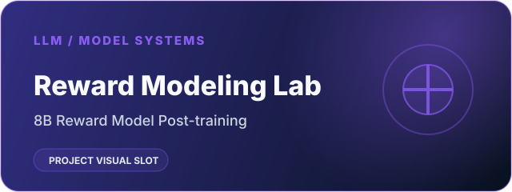
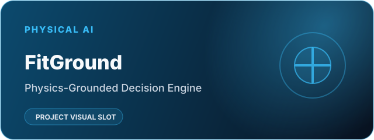
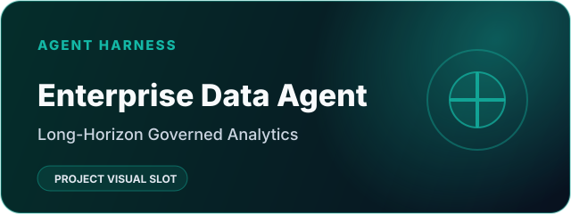
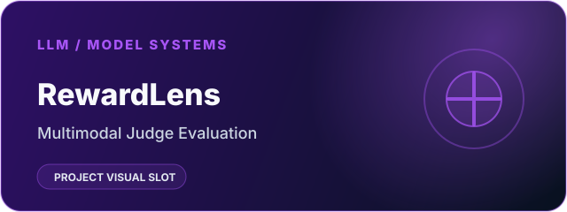
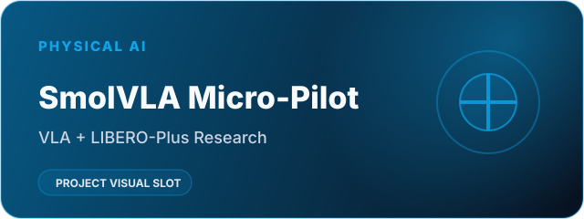
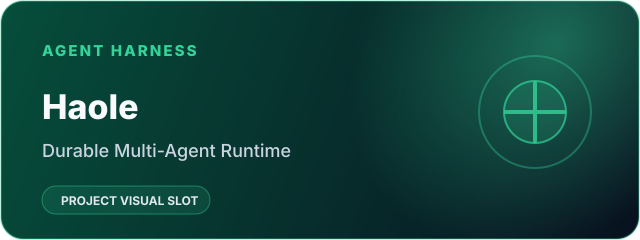
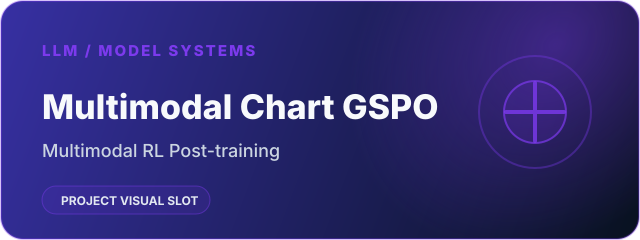
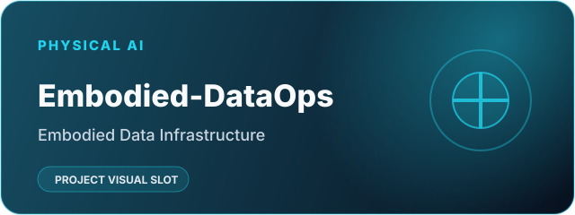

  

  

  <a href="https://benjamindaoson.github.io/daoson_website/">个人主页</a> ·
  <a href="https://benjamindaoson.github.io/daoson_website/knowledge/">知识库</a> ·
  <a href="https://github.com/Benjamindaoson?tab=repositories">全部仓库</a>

<table>
  <tr>
    <td width="33%" valign="top">
      <h2>🤖 Agent Harness</h2>
      <b>智能体系统工程</b> 围绕模型构建可靠智能体：Runtime、状态、工具、编排、恢复与评估。
    </td>
    <td width="33%" valign="top">
      <h2>🧠 大模型与模型系统</h2>
      <b>后训练 · 奖励模型 · 多模态</b> 通过偏好学习、强化学习与受控评估训练、对齐和审计模型行为。
    </td>
    <td width="33%" valign="top">
      <h2>🦾 Physical AI</h2>
      <b>具身智能</b> 通过 VLA、仿真、具身数据和决策系统，把模型连接到物理世界。
    </td>
  </tr>

  <tr>
    <td valign="top">
      
       <b><a href="https://github.com/Benjamindaoson/SalesBoost">SalesBoost</a></b>
      
       企业级多智能体销售赋能平台。
    </td>
    <td valign="top">
      
       <b><a href="https://github.com/Benjamindaoson/reward-modeling-lab">Reward Modeling Lab</a></b>
      
       8B 奖励模型后训练：QLoRA、偏好学习与审计驱动评估。
    </td>
    <td valign="top">
      
       <b><a href="https://github.com/Benjamindaoson/FitGround">FitGround</a></b>
      
       基于物理证据的决策引擎，把仿真证据连接到显式设计动作。
    </td>
  </tr>

  <tr>
    <td valign="top">
      
       <b><a href="https://github.com/Benjamindaoson/enterprise-data-agent">Enterprise Data Agent</a></b>
      
       面向企业分析的长程智能体：规划、持久状态、证据验证与异常恢复。
    </td>
    <td valign="top">
      
       <b><a href="https://github.com/Benjamindaoson/RewardLens">RewardLens</a></b>
      
       面向多模态 Judge 与 Reward Model 的受控行为审计。
    </td>
    <td valign="top">
      
       <b><a href="https://github.com/Benjamindaoson/smolvla-libero-plus-micro-pilot">SmolVLA Micro-Pilot</a></b>
      
       基于 LIBERO-Plus 的 VLA 微型实验，研究初始状态 OOD 与受控微调。
    </td>
  </tr>

  <tr>
    <td valign="top">
      
       <b><a href="https://github.com/Benjamindaoson/haole">Haole</a></b>
      
       耐久型多智能体 Runtime 与工作台：MCP、HITL、Redis Streams 与可回放事件流。
    </td>
    <td valign="top">
      
       <b><a href="https://github.com/Benjamindaoson/multimodal-chart-gspo">Multimodal Chart GSPO</a></b>
      
       多模态推理后训练：GSPO 与任务感知奖励设计。
    </td>
    <td valign="top">
      
       <b><a href="https://github.com/Benjamindaoson/Embodied-DataOps">Embodied-DataOps</a></b>
      
       具身数据基础设施方向，目前处于早期建设阶段。
    </td>
  </tr>

  <tr>
    <td valign="top">
      <b>其他项目</b> 
      
        <a href="https://github.com/Benjamindaoson/agentic-delivery-os">Agentic Delivery OS</a> ·
        <a href="https://github.com/Benjamindaoson/api-test-platform">API Test Platform</a> ·
        <a href="https://github.com/Benjamindaoson/SmartOrderingAgent">SmartOrderingAgent</a> ·
        <a href="https://github.com/Benjamindaoson/Agentic_Content_Optimizer">Agentic Content Optimizer</a> ·
        <a href="https://github.com/Benjamindaoson/trajectory-level-alignment">Trajectory-Level Alignment</a> ·
        <a href="https://github.com/Benjamindaoson/StateLegacy-E0">StateLegacy</a>
      
    </td>
    <td valign="top">
      <b>其他项目</b> 
      
        <a href="https://github.com/Benjamindaoson/text2sql-agentic-rl">Text2SQL Agentic RL</a> ·
        <a href="https://github.com/Benjamindaoson/financial-reward-agentic-rl">Financial Reward Agentic RL</a> ·
        <a href="https://github.com/Benjamindaoson/chinese-news-classification">中文新闻分类与模型压缩</a> ·
        <a href="https://github.com/Benjamindaoson/project-collection-repeat-transformer">Decoder-only LLM 课程</a>
      
    </td>
    <td valign="top">
      <b>当前方向</b> 
      VLA / Robot Foundation Models · 仿真 · 具身评估 · 机器人数据基础设施。
    </td>
  </tr>
</table>

  <b>构建真正有用的 AI 系统 · 做真实实验 · 为开放知识做贡献。</b>

