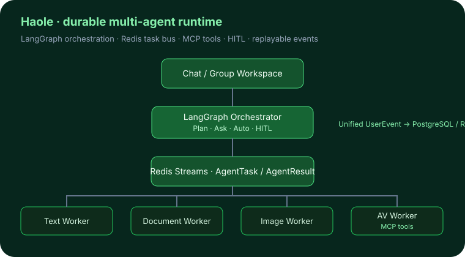
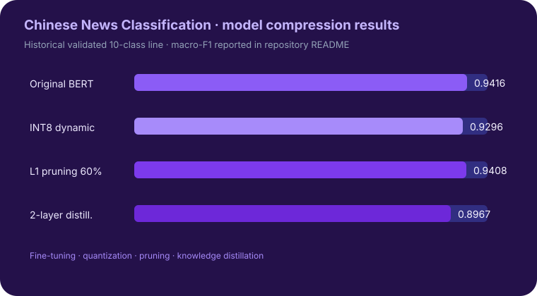
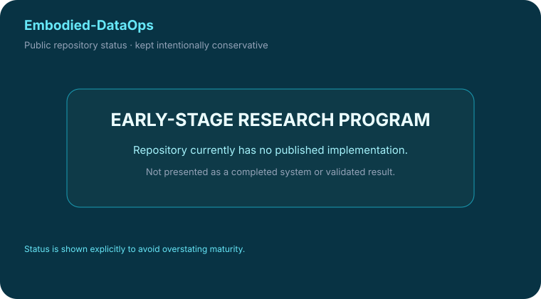

<table>
<tr>
<td width="33%" valign="top">

## 🤖 Agent Harness
<b>智能体系统工程</b> Runtime · 状态 · 工具 · 编排 · 恢复 · 评估

</td>
<td width="33%" valign="top">

## 🧠 大模型与模型系统
<b>训练 · 后训练 · 评估</b> 微调 · 奖励模型 · 偏好学习 · 多模态评估

</td>
<td width="33%" valign="top">

## 🦾 Physical AI
<b>具身智能</b> VLA · 仿真 · 物理证据 · 具身数据

</td>
</tr>

<tr>
<td valign="top">

### [SalesBoost](https://github.com/Benjamindaoson/SalesBoost) <code>旗舰项目</code>
**企业级多智能体平台**

覆盖编排、Hybrid RAG、记忆、评估与可观测性的生产形态销售赋能系统。

</td>
<td valign="top">

### [Reward Modeling Lab](https://github.com/Benjamindaoson/reward-modeling-lab) <code>旗舰项目</code>
**8B 奖励模型后训练**

单卡 QLoRA 后训练，并继续做 shortcut、ranking 与 robustness 审计，而不是只停在单一准确率。

</td>
<td valign="top">

### [FitGround](https://github.com/Benjamindaoson/FitGround) <code>旗舰项目</code>
**基于物理证据的决策引擎**

可执行纸样参数 → 实测几何 → 仿真证据 → 显式决策 / 拒答。

</td>
</tr>

<tr>
<td valign="top">

### [Enterprise Data Agent](https://github.com/Benjamindaoson/enterprise-data-agent) <code>旗舰项目</code>
**长程企业数据分析智能体**

持久任务状态、语义契约、受控分析算子，以及 Claim → Evidence → Verification。

</td>
<td valign="top">

### [RewardLens](https://github.com/Benjamindaoson/RewardLens) <code>研究</code>
**多模态 Judge / Reward Model 评估**

通过受控视觉干预揭示静态 preference accuracy 无法识别的行为差异。

</td>
<td valign="top">

### SmolVLA + LIBERO-Plus Micro-Pilot <code>私有研究</code>
**VLA / 机器人微型实验**

围绕 <code>lerobot/smolvla_libero</code> 的初始状态 OOD 受控实验。这里只展示协议结构，不展示未经验证的 GPU 结果。

</td>
</tr>

<tr>
<td valign="top">

### [Haole](https://github.com/Benjamindaoson/haole) <code>旗舰项目</code>
**耐久型多智能体 Runtime 与工作台**

LangGraph 编排、Redis Streams 任务总线、MCP 工具、HITL 与可回放跨进程事件。

</td>
<td valign="top">

### [Chinese News Classification](https://github.com/Benjamindaoson/chinese-news-classification) <code>模型系统</code>
**微调与模型压缩**

可复现的文本模型流水线：BERT 微调、INT8 量化、剪枝与知识蒸馏。

</td>
<td valign="top">

### [Embodied-DataOps](https://github.com/Benjamindaoson/Embodied-DataOps) <code>新方向</code>
**具身数据基础设施**

公开研究方向仍在建设中，因此明确不把它包装成已完成系统或已验证结果。

</td>
</tr>

<tr>
<td valign="top">

**其他项目**

<a href="https://github.com/Benjamindaoson/SmartOrderingAgent">SmartOrderingAgent</a> ·
<a href="https://github.com/Benjamindaoson/api-test-platform">API Test Platform</a> ·
<a href="https://github.com/Benjamindaoson/Financial_Asset_QA_System">Financial Asset QA</a> ·
<a href="https://github.com/Benjamindaoson/ai-agent-engineering-lab">AI Agent Engineering Lab</a> ·
Agentic Delivery OS · Agentic Content Optimizer

</td>
<td valign="top">

**其他项目**

Text2SQL Agentic RL · Financial Reward Agentic RL · Multimodal Chart GSPO ·
<a href="https://github.com/Benjamindaoson/AIEduRAG">AIEduRAG</a>

</td>
<td valign="top">

**当前方向**

Robot Foundation Models · VLA Evaluation · Simulation · Embodied Data Systems

</td>
</tr>
</table>

  <b>构建真正有用的 AI 系统 · 做真实实验 · 为开放知识做贡献。</b>

