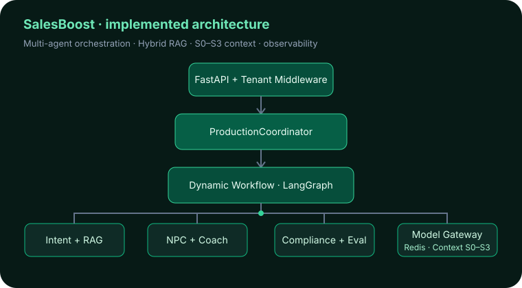
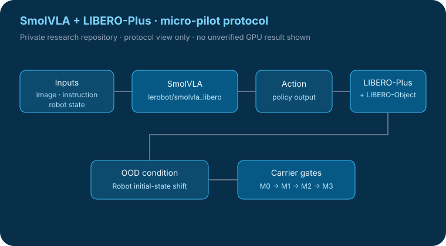

# 赖建铭 · Benjamin Daoson

我主要做三条技术主线：**可靠智能体系统、LLM 后训练与评估、Physical AI**。

| 🤖 智能体系统 | 🧠 大模型与模型系统 | 🦾 Physical AI |
| --- | --- | --- |
| Runtime · 状态 · 工具 · 恢复 · 评估 | 后训练 · 奖励模型 · 偏好学习 · 多模态评估 | VLA · 仿真 · 物理证据 · 具身数据 |

---

## 旗舰项目

### 🤖 智能体系统

<table>
<tr>
<td width="33%" valign="top">

### [BA Agent｜商业分析智能体](https://github.com/Benjamindaoson/enterprise-data-agent) <code>旗舰项目</code>
**Business Intelligence & Autonomous Operations**

长程商业分析 Agent：持久任务状态、Semantic Layer、受治理分析、证据验证、HITL 安全、BusinessAgentBench、SFT/GRPO 实验、PostgreSQL/Redis Runtime 与可观测性。

</td>
<td width="33%" valign="top">

### [AI Engineering Project OS](https://github.com/Benjamindaoson/ai-engineering-project-os) <code>旗舰项目</code>
**长程工程 Agent Harness**

读取真实代码仓库，识别工程缺口，生成升级任务，在受控工作区修改代码并运行测试，以独立验证和证据记录判断任务是否真实完成。

</td>
<td width="33%" valign="top">

### [SalesBoost](https://github.com/Benjamindaoson/SalesBoost) <code>旗舰项目</code>
**企业级多智能体销售平台**

面向真实销售赋能场景，覆盖多智能体编排、Hybrid RAG、记忆、业务流程、评估与可观测性。

</td>
</tr>
</table>

### 🧠 大模型与模型系统

<table>
<tr>
<td width="50%" valign="top">

### [Reward Modeling Lab](https://github.com/Benjamindaoson/reward-modeling-lab) <code>旗舰项目</code>
**8B 奖励模型后训练**

单卡 4-bit QLoRA 训练奖励模型，并继续做 shortcut、ranking 与 robustness 审计，重点判断模型是否“因为正确的原因”取得高分。

</td>
<td width="50%" valign="top">

### [RewardLens](https://github.com/Benjamindaoson/RewardLens) <code>研究旗舰</code>
**多模态 Judge / Reward Model 评估**

通过受控视觉干预研究：静态准确率相同的模型，是否真的以相同方式依赖视觉证据。

</td>
</tr>
</table>

### 🦾 Physical AI

<table>
<tr>
<td width="60%" valign="top">

### [FitGround](https://github.com/Benjamindaoson/FitGround) <code>旗舰项目</code>
**基于物理证据的决策引擎**

可执行纸样参数 → 实测几何 → 仿真证据 → 显式下一版修改决策 / 拒答。强调物理证据，不把视觉合理性当作真实测量。

</td>
<td width="40%" valign="top">

### SmolVLA + LIBERO-Plus Micro-Pilot <code>私有研究</code>
**VLA 适配研究**

围绕 `lerobot/smolvla_libero` 的初始状态 OOD 受控实验。研究尚未完成前保持私有，不展示未经验证的 GPU 结果。

</td>
</tr>
</table>

---

## 精选案例项目

这些项目有独立价值，但不会和旗舰项目放在同一层级竞争注意力。

- [SmartOrderingAgent](https://github.com/Benjamindaoson/SmartOrderingAgent) — 显式确认、事务安全、受控写操作的餐厅订位 Agent。
- [API Test Platform](https://github.com/Benjamindaoson/api-test-platform) — 面向 API 质量的变更影响分析、测试生成、执行和 Release Gate。
- [StuckToShip / AIEduRAG](https://github.com/Benjamindaoson/AIEduRAG) — 面向 RAG / LangGraph / MCP 学习过程的证据驱动 AI 工程导师。
- [Haole](https://github.com/Benjamindaoson/haole) — Redis Streams、MCP、HITL、耐久事件驱动的多智能体工作台。
- [Financial Asset QA System](https://github.com/Benjamindaoson/Financial_Asset_QA_System) — 金融 QA 的确定性流水线、工具执行、数据校验与受控生成。

---

## 教学与公开基础设施

- [AI Agent Engineering Lab](https://github.com/Benjamindaoson/ai-agent-engineering-lab) — Agent Runtime、RAG、MCP、A2A、多模态与工作流工程教学仓。
- [TIAI Website](https://github.com/Benjamindaoson/TIAI_website) — 机构网站。
- [个人网站](https://github.com/Benjamindaoson/daoson_website) — 技术文章、项目记录与公开知识库。

---

## 作品集原则

公开仓库尽量明确区分：

- **已实现** 与计划；
- **已测量** 与示意值；
- **生产形态** 与真实生产部署；
- **研究证据** 与产品宣传。

公开作品集会刻意比私有实验仓更少、更聚焦。

  <b>构建有用的 AI 系统 · 做真实实验 · 只报告可验证结果。</b>

